# Dashboard

## General

The dashboard is one way to interact with Hanami.

!!! warning

    The current dashboard is only a first prototypical implementation and NOT maintained at the momentan due to a lack of time. This documentation is not up-to-date at the moment, I'm very sorry, but it should be still enough to give a basic impression of the current state and workflow.

## Example workflow

### Login

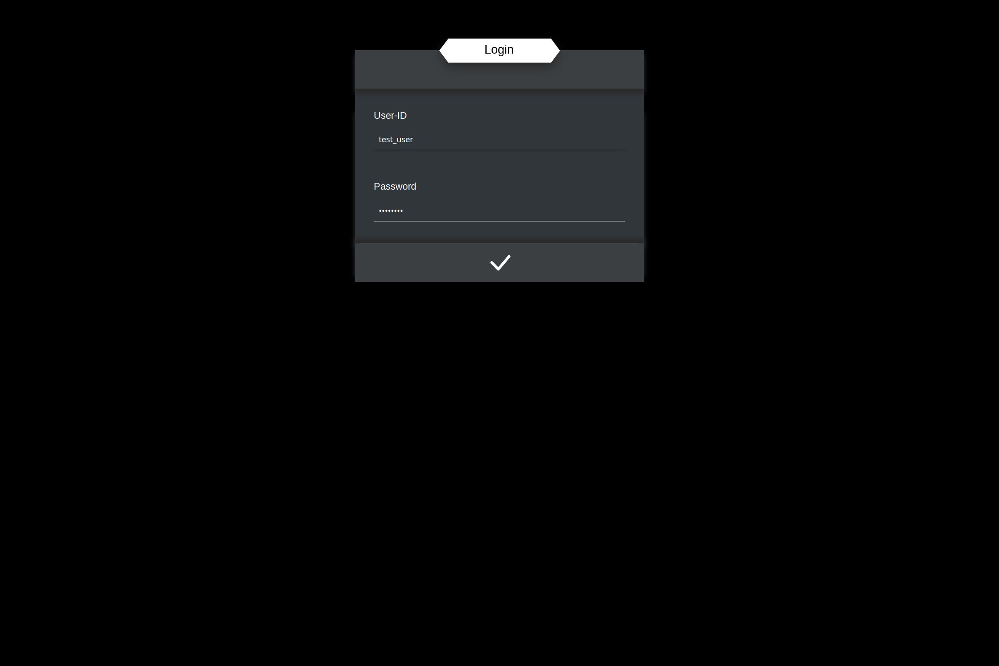

Login should quite self-explaining. In case you used the [installation-guide](/How_To/1_installation/) you have to use the values of `USER_ID` (NOT the `USER_NAME`) and `PASSWORD` for the login.

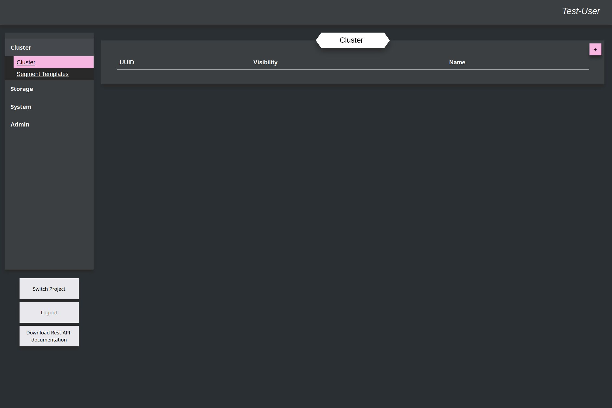

The first you look at after the login is the cluster-overview, which is in this case still empty. On the left side there are the different sections. The `Cluster`-section contains interactions with [Kyouko](/Inner_Workings/3_kyouko/), the `Storage`-section the interactions with [Shiori](/Inner_Workings/5_shiori/), `System`-section interactions with [Azuki](/Inner_Workings/4_azuki/) and `Admin`-section everything for [Misaki](/Inner_Workings/6_misaki/).

### Upload Data-Set

The first step is to upload a data-set with data, which will be the input for the network. In this example a table in form of a CSV-file is used.

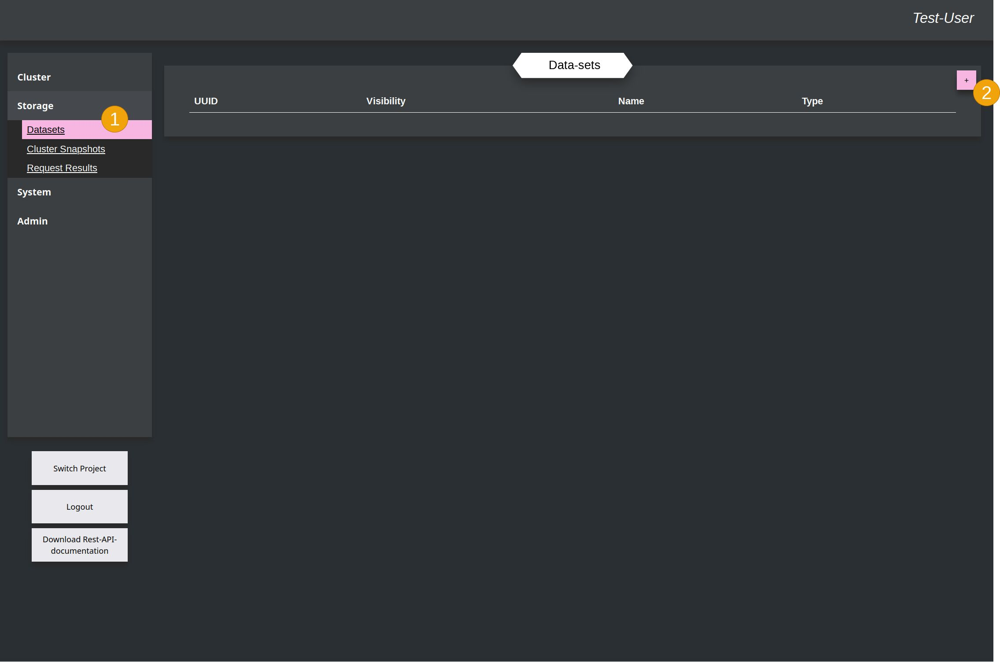

On the left side you have to select the `Storage` and within this section the `Datasets` (**1**). You switch to the overview of data-sets, which is also still empty at the moment. To upload a new file you have to click in the upper right corner on the add-button (**2**).


After this a new small window opens. There, in this example the `CSV` (**1**) has to be selected in order to upload a csv-file and give it a name for later identification (**2**). Then over the file-chooser (**3**) the file has to be selected.  The single values within the CSV-file must be separated by `,`. At the end accept it (**4**) to upload the file.

!!! example

    For this example workflow here, this [Example-file](/How_To/train.csv) was used and uploaded, and looks like this

    ```
    input,output
    0,0
    0,0
    0,0
    0,0
    0,0
    ...
    42,1
    42,1
    42,1
    42,1
    42,1
    ...
    10,0.5
    10,0.5
    10,0.5
    10,0.5
    10,0.5
    ...
    0,0
    0,0
    0,0
    0,0
    0,0
    ...
    ```


!!! example

    Addtional there is this [Example-file](/How_To/test.csv) for testing of the trained network.

    ```
    test_input,test_output
    0,0
    0,0
    0,0
    0,0
    0,0
    ...
    30,0
    30,0
    30,0
    30,0
    30,0
    ...
    20,0
    20,0
    20,0
    20,0
    20,0
    ...
    0,0
    0,0
    0,0
    0,0
    0,0
    ...
    ```

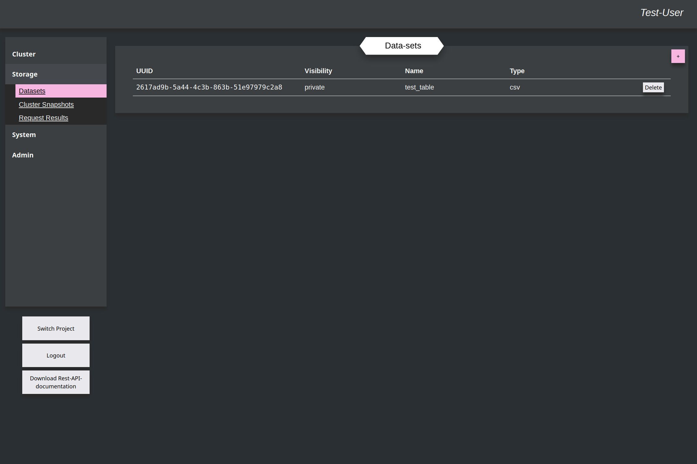

The window is still open, until the upload is finished. This will be fixed later with progress-bar for better feedback. After this the new uploaded file is printed in the data-set-table.

### Create Cluster

Next you have to create the cluster itself based on the template.

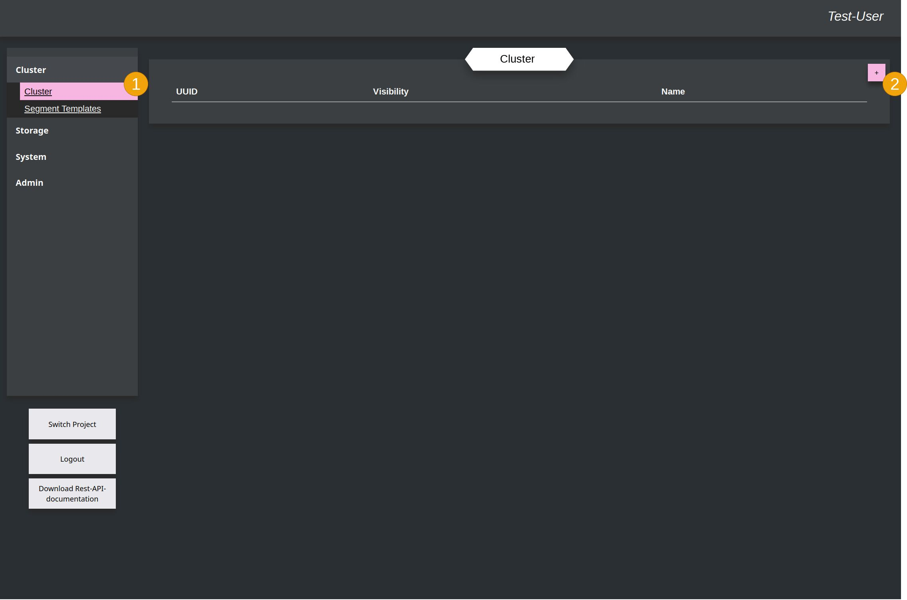

Same procedure: Go to the `Cluster` chapter (**1**) and add a new `Cluster` (**2**).

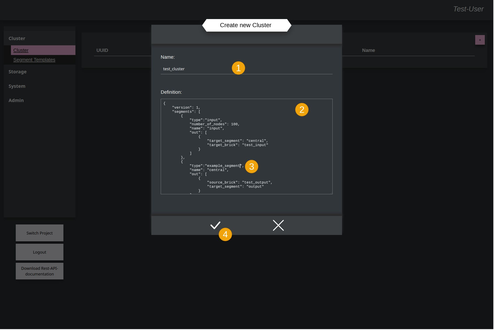

Here you have to give it again a name (**1**) and a `Cluster-Template` (**2**). Within the template the name of the previously uploaded `Segment-Template` (**3**) is used as segment for this example Cluster. At the end accept again to create the cluster (**4**).

See basic explanation of the [templates](/Inner_Workings/3_kyouko/#templates)

!!! example "Example Template"

    ```
    version: 1      
    bricks:
        1,1,1
            input: test_input
            number_of_neurons: 20
        2,1,1
            number_of_neurons: 10
        3,1,1
            output: test_output
            number_of_neurons: 5
    ```


Now the cluster is created in Kyouko and ready to train things.

### Create Tasks

DirectIO to directly interact with the cluster over a websocket is not available in the Dashboard. For the dashboard you can only use previously uploaded `Data-Sets`, which can be given the cluster as task. 

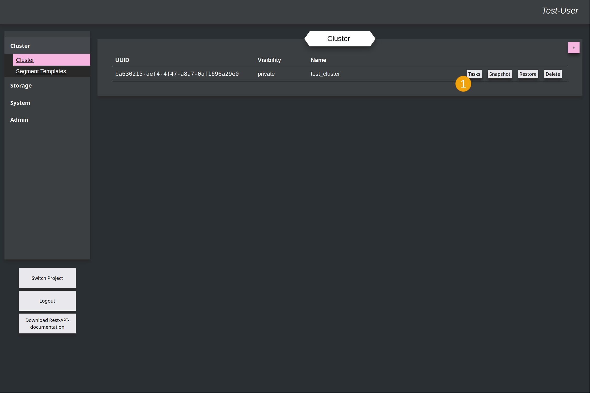

Go to the `Task`-Overview of the cluster by clicking the button (**1**).

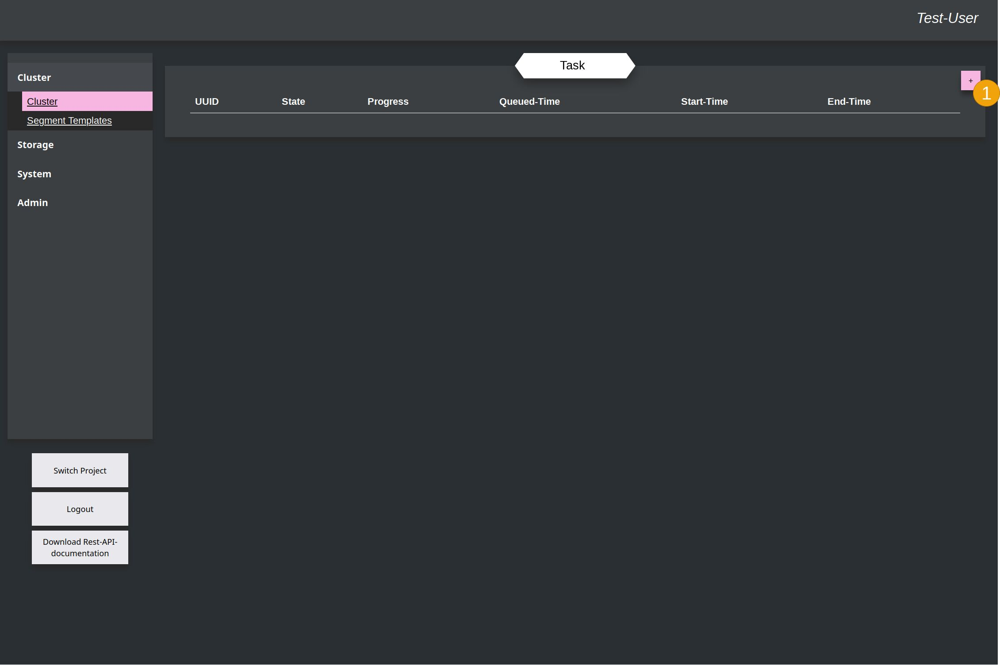

This switch the window to the overview of all Tasks for the `Cluster`. With the add-button (**1**) a new task can be created.

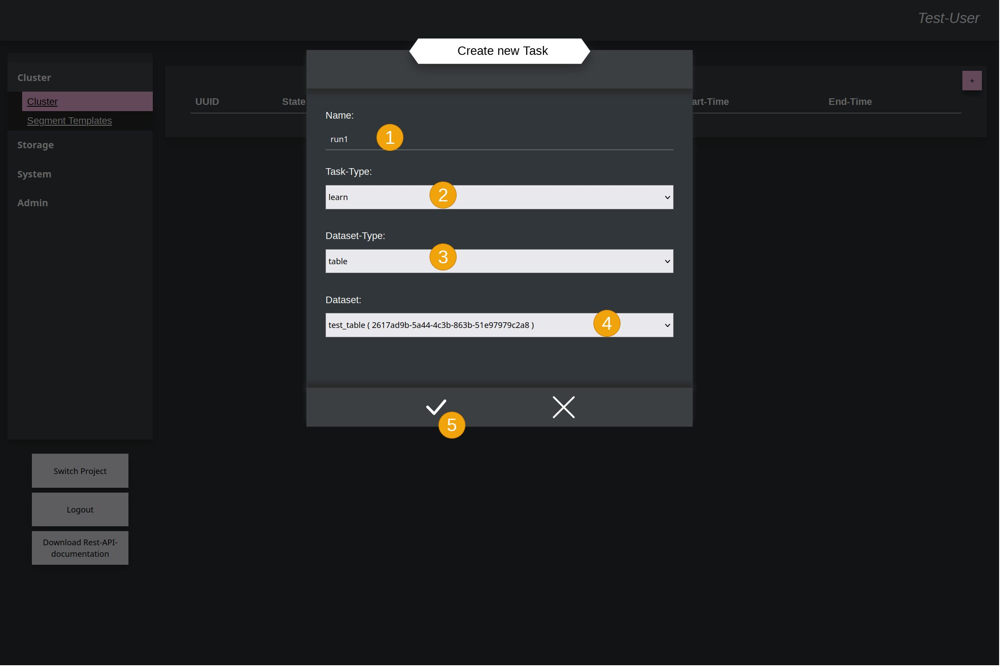

In the new window you can give it a name (**1**) and say that the cluster should train data (**2**). (**3**) is deprecated and not necessary anymore. The type of the dataset doesn't have to be explicit specified.

Then select the data-set in the dropdown menu (**4**) and accept again (**5**).

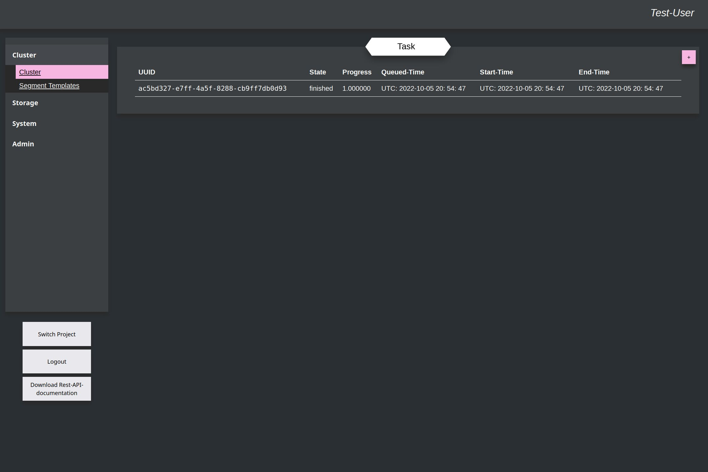

After this it switch back to the overview of the tasks, where the new one appears, with progress and timestamps. Because the example is really small, all timestamps here have the same value, because everything runs through in the same second.


After this a few more of the same task can be created to improve the train-result.

!!! note

    With version `0.3.0` it will be also possible to define multiple runs to avoid this manually created of multiple tasks. Originally this project was only developed with the SDK-library and Tsugumi as test-tool, where multiple tasks can easily created with a for-loop. So this user-impact only appeared in the Dashboard, which is the reason, why it is at the moment like it is.

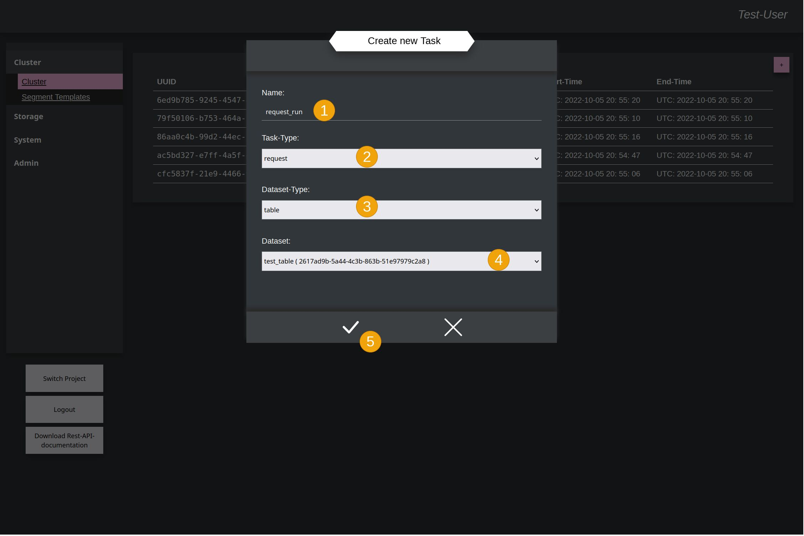

After the `Cluster` was trained with some data, now a `Request-Task` can be created to see how the result looks, when only input-data are given. Create a new task again and give it a name (**1**). This name will be the same like the `Result` at the end for better identification. Select with time `request` (**2**) as task-type. Type (**3**) and Data-set (**4**) are the same like last time while learning. And accept (**5**) again to create the task. 


To see the result of the task after it was finished, you have to switch to the `Request-Result`-chapter (**1**) in the `Storage`-section, because at the end, `Kyouko` send the result to `Shiori` to write this in the database. Here the result is listed with the same name, like the request-task (**2**). Now the result can be downloaded (**4**) as json-formated string in a file or directly shown as graph (**3**) with the help of the d3-library.

Result for the [Train-file](/How_To/train.csv):

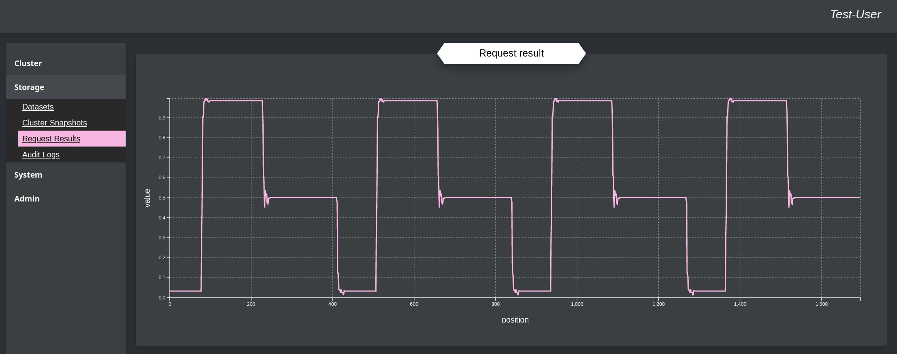

Result for the [Test-file](/How_To/test.csv)


The output of this example is not optimal, but basically correct, when comparing the the up-and-down of the given input-values above. With a more optimal templates or more train-tasks, the graph would look better. There is on the upper picture the real output of the cluster the on the other the rounded values, where all above 0.5 is rounded to 1.0 and the rest to 0.0. 

### Other

As additional feature for example you can also show the thermal output the CPU of the node, where the project is running.

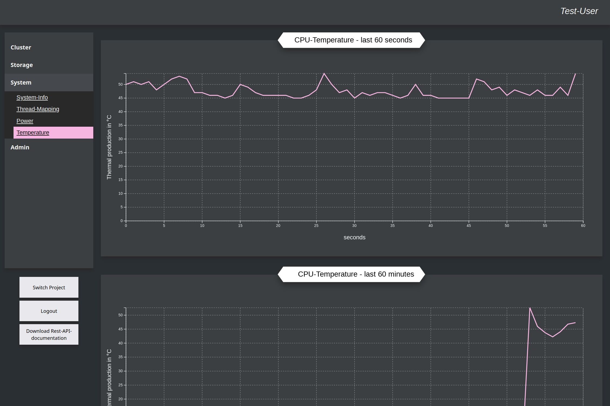
